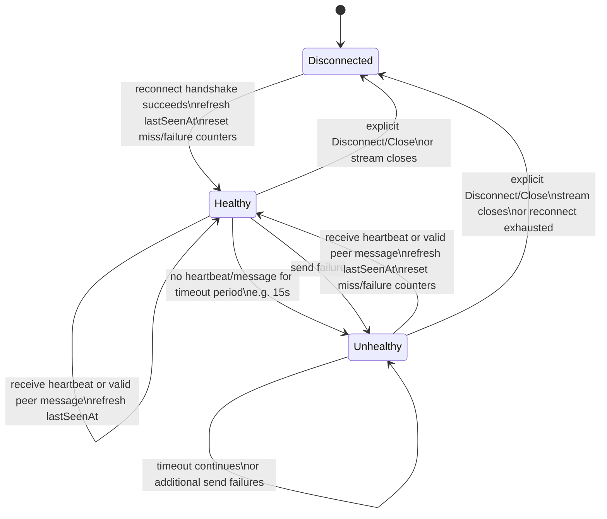

# EventMesh Design

This document describes the current EventMesh implementation and separates it
from planned production work. Older notes in this repository sometimes described
RocksDB, mTLS, or a gRPC client SDK as MVP requirements; those are now roadmap
items, not current behavior.

## Product North Star

EventMesh should grow toward a lightweight event mesh for observable,
replayable, real-time application coordination. It is not trying to become a
smaller Kafka. Its more distinctive path is to stay understandable and
HTTP-native while becoming easy for humans, services, and AI agents to inspect,
replay, validate, publish into, and debug safely.

See [north-star.md](north-star.md) for the longer positioning and
agent-friendly design direction. The sections below describe current behavior
unless explicitly marked as roadmap work.

## Current System Shape

EventMesh is currently a single Go process that can expose:

- an HTTP API for clients
- a gRPC PeerLink listener for mesh peers
- an EventLog, defaulting to in-memory with optional Pebble durability
- an in-memory RoutingTable
- a MeshNode orchestrator that connects the pieces

The server binary is `bin/eventmesh`; the CLI binary is `bin/eventmesh-cli`.

```text
  HTTP clients / CLI
           |
           v
    internal/httpapi
           |
           v
   internal/meshnode
   |       |        |
   v       v        v
EventLog Routing PeerLink
          Table     |
                    v
                Mesh peers
```

## Core Components

### MeshNode

`internal/meshnode.GRPCMeshNode` is the core coordinator. It:

- starts and stops EventLog, RoutingTable, and PeerLink
- authenticates simple client IDs for internal tests
- persists locally published events before delivery
- looks up local subscribers through the RoutingTable
- forwards events to peers that have expressed interest
- tracks client subscription metadata for the HTTP API
- propagates subscription changes to peers through the PeerLink control plane

### EventLog

EventLog provides:

- append-only event storage by topic
- per-topic offsets
- reads from a topic offset with a limit
- replay channels for topic replay
- statistics for health checks

The default backend is in-memory. A Pebble-backed durable backend is also
available for local durable storage. It stores complete event records with
protobuf encoding, uses length-prefixed binary keys for topic isolation and
ordered offset scans, commits appends with Pebble sync writes, and serializes
append offset assignment with a single writer lock for the initial
implementation.

Run the server with durable storage:

```bash
./bin/eventmesh --eventlog-backend pebble --eventlog-path ./data/eventlog
```

Current limitation: durable subscriber offsets and peer replay/resume are not
implemented yet, so the durable EventLog supports local append/read/replay
survival across process restarts but does not by itself make live subscribers or
peers durable consumers.

### RoutingTable

The current RoutingTable implementation is in-memory. It maps topic patterns to
subscribers and supports exact matching plus single-segment `*` wildcards.

Examples:

- `orders.created` matches only `orders.created`
- `orders.*` matches `orders.created` and `orders.updated`
- `*` matches one-segment topics only

Multi-segment wildcards such as `orders.#` are not implemented.

### PeerLink

PeerLink is implemented with gRPC bidirectional streaming. It has two logical
planes:

- data plane: user events between peers
- control plane: subscription-change messages between peers

Heartbeats are control-plane messages. They should never be delivered as user
events or mixed into the data-plane routing path. Each peer has independent
data-plane and control-plane send queues, and ready control-plane messages are
selected before data-plane messages so subscription gossip and heartbeats are
not starved by user event traffic.

Architecture decision: EventMesh keeps one physical peer RPC stream for now:
`PeerLink.EventStream(stream PeerMessage) returns (stream PeerMessage)`.
The separation between data plane and control plane is logical, not physical.
Both planes are multiplexed over `EventStream`, while separation is enforced
through typed `PeerMessage` frames, focused Go interfaces, independent per-peer
send queues, and control-first queue selection. Splitting the proto into
separate `DataStream` and `ControlStream` RPCs is deferred until tests or
operational experience show that independent physical transport is necessary.

PeerLink metrics expose both aggregate peer counters and per-plane counters.
Queue depth, accepted queued messages, drops, and send failures are reported
separately for data-plane and control-plane traffic so operators can distinguish
user-event backpressure from subscription/heartbeat pressure.

#### Peer Health State Model

Peer health is local to the observing node. `Disconnected` means this node does
not currently have an active usable connection to the peer; it does not prove
the remote process is globally down. By default, heartbeats are sent every `5s`
and a peer becomes `Unhealthy` after `3` missed heartbeat intervals (`15s`)
without any heartbeat or other valid peer message.



Agent-readable transition contract:

| From | Signal | To | Required side effects |
| ---- | ------ | -- | --------------------- |
| `Disconnected` | reconnect handshake succeeds | `Healthy` | refresh `lastSeenAt`; reset missed-heartbeat and send-failure counters |
| `Healthy` | receive heartbeat or valid peer message | `Healthy` | refresh `lastSeenAt` |
| `Healthy` | no heartbeat or valid peer message within timeout window | `Unhealthy` | keep connection machinery alive; avoid treating peer as reliably routable |
| `Healthy` | send failure | `Unhealthy` | increment send-failure counter |
| `Healthy` | explicit disconnect, close, or stream close | `Disconnected` | stop active connection work for that peer |
| `Unhealthy` | receive heartbeat or valid peer message | `Healthy` | refresh `lastSeenAt`; reset missed-heartbeat and send-failure counters |
| `Unhealthy` | timeout continues or additional send failures | `Unhealthy` | continue retry/monitoring behavior |
| `Unhealthy` | explicit disconnect, close, stream close, or reconnect exhaustion | `Disconnected` | stop active connection work for that peer |

Implementation status: heartbeat send/receive, periodic heartbeat sending,
missed-heartbeat timeout detection, `lastSeenAt`, missed-heartbeat counts, and
send-failure counts are implemented.

Current limitations:

- mTLS is not implemented yet
- cross-node ACK/resume semantics are not production-grade
- peer discovery is currently static seed based

### HTTP API

The HTTP API is implemented under `internal/httpapi`.

Current endpoints:

```http
GET  /api/v1/health
POST /api/v1/auth/login

POST /api/v1/events
GET  /api/v1/topics/{topic}/events?offset=0&limit=100
GET  /api/v1/events/stream

POST   /api/v1/subscriptions
GET    /api/v1/subscriptions
DELETE /api/v1/subscriptions/{id}

GET /api/v1/admin/clients
GET /api/v1/admin/subscriptions
GET /api/v1/admin/stats
```

Authentication uses JWTs generated by `POST /api/v1/auth/login`. In development
mode, `--no-auth` bypasses client auth for non-admin routes. Admin routes still
require an admin JWT.

## Subscription And SSE Model

EventMesh uses one subscription model:

1. A client creates subscriptions through `POST /api/v1/subscriptions`.
2. The MeshNode stores subscription metadata for that client.
3. The RoutingTable is updated so matching events can be delivered.
4. `GET /api/v1/events/stream` opens an SSE connection for the client's active
   subscriptions.

`GET /api/v1/events/stream?topic=...` is intentionally rejected. This avoids a
second subscription mechanism hidden in the stream endpoint.

The Go HTTP client and CLI provide a convenience on top of this model:

- `StreamConfig{Topics: []string{"orders.*", "payments.*"}}` or repeated
  `eventmesh-cli stream --topic orders.* --topic payments.*` creates temporary
  subscriptions if they do not already exist.
- The client connects to the unified SSE stream.
- The client filters received events locally.
- Temporary subscriptions created by the client are removed when the stream
  closes.

SSE stream attachment is connection-scoped and does not create extra
subscription metadata. The Go client re-ensures configured `StreamConfig.Topics`
before each reconnect so managed streams recover when an ephemeral subscription
set is lost by a server restart. Raw HTTP clients and streams opened without
configured topics must manage subscription recreation themselves.

### SSE Resume Semantics

SSE resume is node-local, local-log resume. The SSE `id:` field is a resume
cursor derived from the serving MeshNode's local EventLog position, not from a
publishing client-provided ID. For a locally published event, the cursor is
derived after the local EventLog append assigns the topic offset. For an inbound
peer event, the receiving node first appends the event to its own EventLog, then
streams it to local SSE clients with a cursor for the receiving node's local log
position.

Cursor shape for a single streamed event:

```json
{"v":1,"nodeId":"node-a","topic":"orders.created","offset":42}
```

The cursor is encoded for the SSE `id:` line. Data events should always include
an SSE event ID; keepalive comments such as `: ping` do not have IDs.

The Go HTTP client can maintain a stronger multi-topic resume cursor while it
streams events from multiple active subscriptions:

```json
{"v":1,"nodeId":"node-a","topics":{"orders.created":42,"payments.completed":9}}
```

On reconnect, clients send the cursor through the standard `Last-Event-ID`
header. The server also accepts `?since=...` for manual clients and tests. The
server accepts both single-event cursors and multi-topic cursors. For a
multi-topic cursor, it replays each cursor topic from `offset + 1` if that topic
is still covered by one of the client's active subscriptions. Topics not present
in the cursor are live-only until durable per-subscription offsets exist.

Phase 1 resume is intentionally sticky to a node. Cursor offsets refer to the
serving node's local EventLog, so a cursor for `node-a` is not safely
interpretable by `node-b`. If a client reconnects to a different node, the
server rejects the resume request with `409 Conflict` and a clear message
that the cursor belongs to another node. The client may retry the original node
or start a fresh stream elsewhere. Cross-node durable resume is future work.

When using Pebble durable storage with SSE resume, operators should configure a
stable explicit `--node-id`. Changing a node ID while reusing the same durable
EventLog path invalidates existing resume cursors. A later hardening phase may
store node identity metadata in the EventLog and fail or warn if a durable log is
opened by a different node ID.

Resume replay registers the live SSE stream before replaying missed
events. This avoids losing new live events during catch-up, but it can produce
duplicates. EventMesh's delivery contract is at-least-once, so SSE clients must
be duplicate-tolerant and should deduplicate by SSE event ID.

Fluid live mesh routing and durable resume are separate concerns. Publishers and
subscribers do not need to know each other for live routing, and the mesh can
route new events around topology changes. Durable resume asks a stronger
question: which ordered local log should replay old events? Phase 1 answers that
with a node-local cursor. Later phases may add stable node identity enforcement,
global event identity, distributed replay lookup, or durable per-subscription
offsets.

When a peer connects or reconnects, MeshNode resends its current local
subscription metadata to that peer through the control plane. This rebuilds
routing interest after network healing. It does not replay user events that were
published while the peer was disconnected; catch-up and replay remain explicit
EventLog read concerns.

## Delivery Guarantees

EventMesh is designed around local-first durability and at-least-once,
duplicate-tolerant delivery. It does not currently provide, or try to provide,
exactly-once delivery.

### Publisher Contract

When `PublishEvent` or `PublishEventWithResult` succeeds, the event has been
appended to the local node's EventLog. Local persistence happens before local
subscriber delivery and before forwarding to peers. Peer forwarding can still
partially fail after local persistence succeeds, so API and test behavior should
not treat remote delivery as part of the local durability guarantee.

### Mesh Delivery Contract

Node-to-node delivery is at-least-once. A peer may see duplicate events during
send retries, reconnects, topology changes, and future replay or resync flows.
Receivers should therefore be duplicate-tolerant. Tests should assert that
events are not silently lost when local persistence succeeds, but they should
not assume exactly-once cross-node delivery unless a test is specifically
checking duplicate suppression behavior.

When a node accepts a user event from a peer, it appends that event to its local
EventLog before delivering it to local subscribers. If the local append fails,
the event is not delivered to local subscribers from that inbound peer path.

PeerLink retries failed sends for a bounded number of attempts
(`MaxSendAttempts`, default `3`). A message that exhausts its retry budget, or
cannot be requeued because the bounded peer queue is full, is counted as a drop
and the peer is marked `Unhealthy`. The publishing node's local EventLog remains
the durable source for later explicit replay or catch-up.

### Subscriber Contract

Live subscriber delivery over SSE or in-memory client channels is best-effort
while the client is connected. SSE resume automates node-local catch-up by using
a cursor that references the serving node's local EventLog. A disconnected
client can also use explicit replay by topic and offset to catch up from the
EventLog. Durable subscriber offsets, acknowledgements, and cross-node resume
semantics remain future design work.

### Non-Goal: Exactly-Once

Exactly-once delivery is intentionally not a current goal. It would require
stable event identities, idempotency keys, durable acknowledgements, subscriber
offset tracking, deduplication storage, and transactional boundaries across
components that EventMesh does not yet have.

## Publish Flow

```text
Client
  -> POST /api/v1/events
  -> HTTP handler validates and builds Event
  -> MeshNode.PublishEventWithResult
  -> EventLog.AppendEvent assigns persisted offset
  -> RoutingTable.GetSubscribers
  -> Local subscribers receive event
  -> Interested peers receive event through PeerLink
  -> HTTP response reports persisted topic/offset
```

The persisted EventLog offset is the source of truth for response `eventId` and
`offset`.

## Read And Replay Flow

The HTTP read path is:

```http
GET /api/v1/topics/{topic}/events?offset=0&limit=100
```

The CLI wraps this as:

```bash
eventmesh-cli topics info --topic test.events
eventmesh-cli replay --topic test.events --offset 0 --limit 100
```

## Node Startup And Discovery

The server accepts static seed nodes:

```bash
./bin/eventmesh --http --node-id node2 --peer-listen :9091 \
  --seed-nodes localhost:9090
```

At startup, the node uses the seed list to connect to peers. Broader discovery
options such as DNS seeds, mDNS, Kubernetes, and cloud tags are future design
work captured in [discovery.md](discovery.md).

## Current Non-Goals

These are useful directions, but they are not current implementation facts:

- distributed or replicated EventLog storage
- mTLS peer authentication
- ACLs or topic-level authorization
- durable subscriptions across node restarts
- ACK/resume for exactly bounded cross-node replay
- production deployment manifests
- a separate gRPC client SDK

## Roadmap

Near-term quality work:

- keep tests reliable and bounded with explicit timeouts
- reduce noisy expected-error logs in tests
- improve admin/metrics endpoints
- clarify peer routing and subscription-gossip guarantees

Production-readiness work:

- Pebble storage hardening, retention, and compaction policy
- mTLS and peer identity
- typed errors and API error contracts
- load and multi-client tests
- deployment examples
- observability metrics

Agent-friendly roadmap work:

- self-describing event metadata and schema references
- topic, schema, publisher, subscriber, and capability discovery APIs
- draft/validate/publish flow for safer agent-initiated events
- replay, search, and timeline views for context recovery
- MCP tooling for agent workflows

## Design Principles

- Persist locally before acknowledging publish.
- Keep HTTP handlers thin; MeshNode owns subscription and routing state.
- Keep stream connections ephemeral.
- Prefer explicit client recovery over hidden server-side durable subscription
  state until persistence and ownership semantics are designed.
- Keep agent and human workflows verifiable through local commands.
- Prefer inspectable, ordinary APIs before agent-specific automation.
